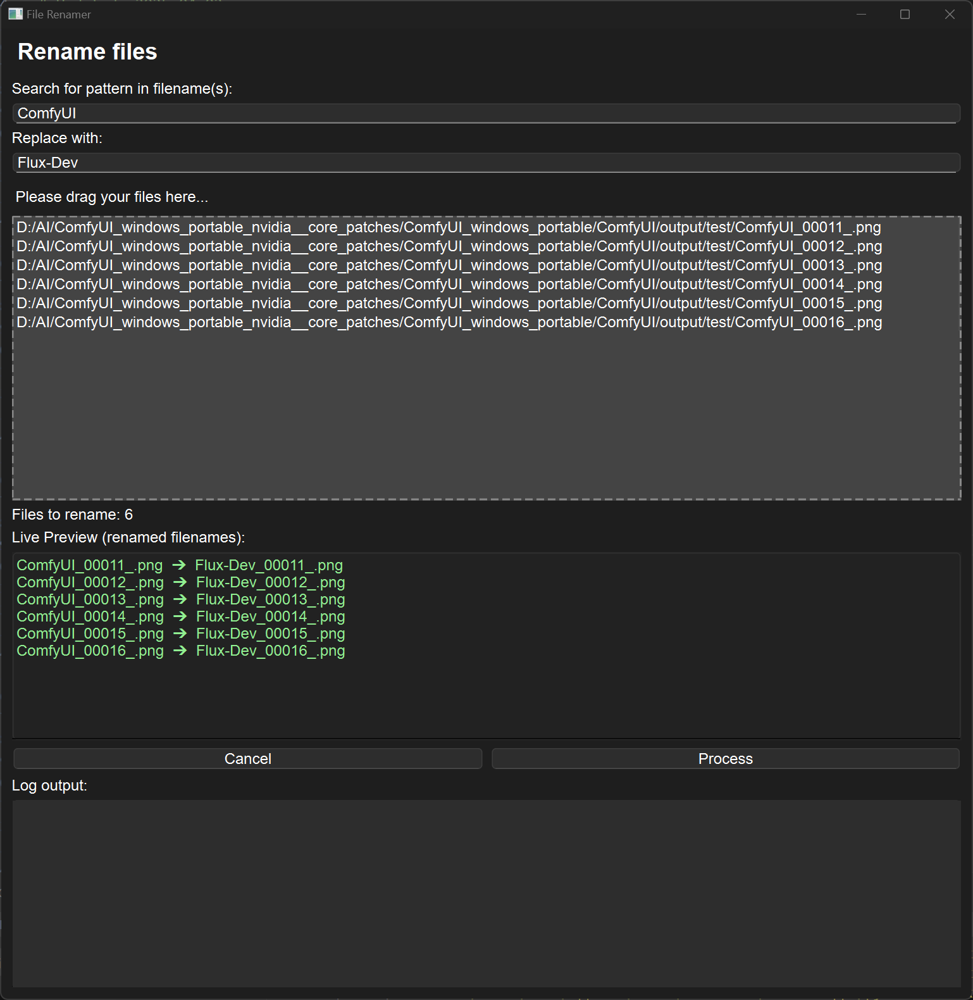

# 🛠 renamer_dnd_Qt6.py

A modern file renaming tool with drag-and-drop support, built using **PyQt6**.

## 🔍 Features

- Simple drag & drop interface for files
- Live preview of renamed filenames
- Supports batch renaming
- Ideal for textures, images, or general file renaming
- Optimized for Windows 10

## 🖼 Screenshot

Here’s what the Qt6 version looks like in action:



## ▶️ Requirements

- Python 3.8 or higher
- PyQt6

Install the required package:

```bash
pip install PyQt6
